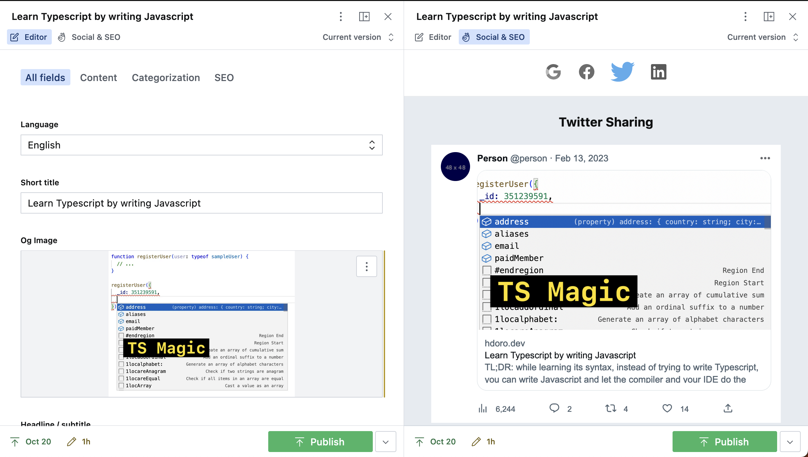

# Sanity social and SEO document preview

Show your editors how their page will look on Google and major social platforms in your documents' view



> This is a **Sanity Studio v3** plugin.
> For the v2 version, please refer to the [0.1.5 version](https://www.npmjs.com/package/sanity-plugin-social-preview/v/0.1.5).

## Installation & usage

Start by installing:

```
npm install sanity-plugin-social-preview
# or
yarn add sanity-plugin-social-preview
```

Now go into your `deskStructure` file and add the following (if you don't have structure builder settings, [check out the official guide](https://www.sanity.io/guides/getting-started-with-structure-builder)):

```js
// deskStructure.js
import { SocialPreview, toPlainText } from 'sanity-plugin-social-preview'

export const getDefaultDocumentNode = ({ schemaType }) => {
  // EXAMPLE: Add the social preview view only to those schema types that support it
  if (['blog.post', 'marketing.page'].includes(schemaType)) {
    return S.document().views([
      S.view.form(),

      // Add your social preview component
      S.view.component(SocialPreview()).title('Social & SEO'),
    ])
  }

  return S.document().views([S.view.form()])
}
```

## Customizing

By default, the plugin will try to extract the data for previews based on common data patterns found in Sanity documents, according to the [fallbackPrepareData function](https://github.com/hdoro/sanity-plugin-social-preview/blob/main/src/fallbackPrepareData.ts).

You can, however, customize which data to pick from the current document and display in its social and SEO previews. For that, pass a `prepareData` function, which must return an object with properties to render:

```js
SocialPreview({
  // Determine how the SEO/social title, description, url and image are extracted from
  // the document's value.
  prepareData: ({ title, seo, body, slug }) => ({
    title: seo.title || title,
    description: seo.description || toPlainText(body || []),
    url: `https://example.com/${slug.current}`,
    image: seo.ogImage,
  }),
}),
```

If, for example, your description comes from `seo.description` and that's [Portable Text](https://www.portabletext.org/) rich text content, you can use the `toPlainText` helper and `truncate` it:

```js
import { SocialPreview, toPlainText, truncate } from 'sanity-plugin-social-preview'


// ...
SocialPreview({
  prepareData: ({ title, seo }) => ({
    title,
    description: truncate(toPlainText(seo?.description || []), 200),
    url: 'https://hdoro.dev',
  }),
}),
```

You can also remove and customize any individual previews:

```js
SocialPreview({
  prepareData: () => ({
    /* your default data preparation... */
  }),

  // Deactivate Facebook previews
  facebook: false,

  // And customize LinkedIn data - this is the same
  linkedin: ({ title }) => ({
    title: `${title} | only on LinkedIn`,
  }),
})
```

Feel free to contribute with your PR, as long as you're respectful. Big thanks to @mornir and @fdfontes for your help!
